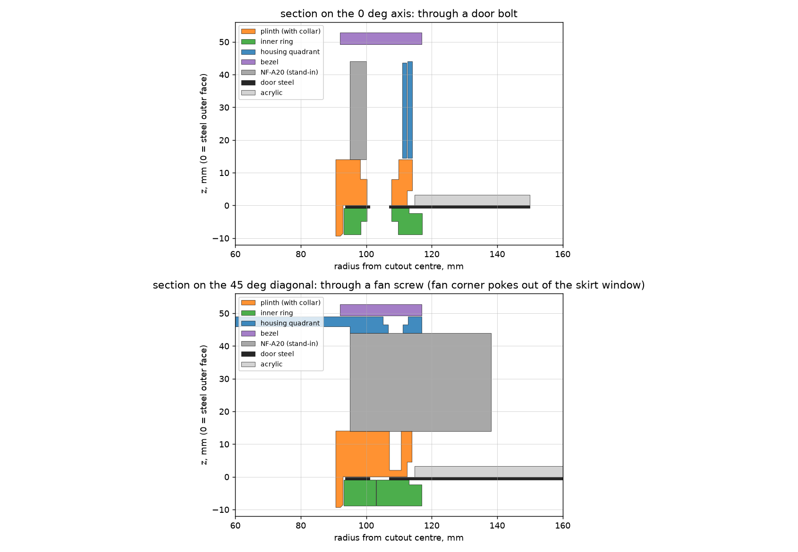

# NF-A20 side-door fan housing

Two designs live here.

* **v3 (current): round external housing, clamped to the cutout.** The
  NF-A20 mounts on the *outside* of the door. Everything stays inside the
  acrylic window's inner edge (r 114.7 mm) so the acrylic is unobstructed:
  a round plinth with a collar through the 187 mm hole, an inner ring inside
  the case that clamps the steel between the two, a cylindrical skirt with
  four windows the fan's corners poke through, a spoke-grille front plate and
  a magnetic mesh dust-filter bezel. The fan lead leaves through whichever
  corner window you turn it to (bottom-left) and runs round to the rear
  grommet. Files: `stl_v2/`, `build_housing.py`, `nfa20_door_housing.scad`,
  `plan_v2.png`, `preview/renders_v2.png`, `preview/section_v3.png`.
* **v1: inside-mount ring.** The original bare adapter ring for mounting the
  fan on the inside face of the door. Kept for reference at the bottom of this
  file. Files: `stl/`, `build_adapter.py`, `nfa20_door_adapter.scad`, `plan.png`.

Both builders produce identical solids from the OpenSCAD and Python sources,
and every printed part is checked to be a single body.

---

## v3: round housing

### What the photos add to the measurements

Fitting a perspective transform to the eight ring holes (all within 1 mm)
puts the acrylic window's cap nuts on a **125 mm radius** at 96, 44, 0, -45
and -96 degrees (outside view), and the acrylic's inner edge at **r 114.7 mm**.
The steel annulus between the cutout and that edge is flat and about 3 mm
below the acrylic. The plinth's outer radius is 114 so it follows that edge
with 0.7 mm to spare; the two cap nuts at +/-45 degrees are under the fan's
corners, which is why the fan sits 14 mm off the steel.

### How the clamp works

* The plinth's bore continues as a **collar**, 185.8 mm OD, 2.2 mm wall,
  9.4 mm long, that drops through the 187 mm cutout. It centres the housing
  and takes shear, so the bolts only see tension.
* An **inner ring** (r 93.2 to 117, 8 mm, four pieces) slides over the collar
  inside the door. Four M5 x 20 socket screws go through it, through the
  door's top/bottom/left/right ring holes, into nuts captured in the plinth.
  The steel is sandwiched between the inner ring and the plinth's bearing
  band (r 90.7 to 112.5), the bare-steel annulus inside the acrylic edge.
* The inner ring's steel face is relieved 1.5 mm beyond r 113 to clear the
  near-flush acrylic screw heads on the inside (r 119 to 128).

### Stack, from the steel outward

| z (mm) | Part | Notes |
|---|---|---|
| -9.4 to 0 | collar + inner ring (4 pinwheel pieces) | collar through the cutout; inner ring counterbored for the M5 heads |
| 0 to 14 | plinth (4 pinwheel pieces) | round, r 90.7 to 114. Bears on steel r 90.7 to 112.5; door face relieved 4.5 mm beyond that as a safety against the acrylic step. M5 nut pockets at r 104 on the axes; blind M4 holes at the fan corners. |
| 14 to 44 | NF-A20 | exhaust face on the plinth, intake outward |
| 14.5 to 44 | skirt (4 quadrants) | cylinder r 111 to 114, sits on the plinth with a 0.5 mm reveal. Four 41.5-degree windows on the diagonals let the fan's corners through. Lap joints at the four seams on the axes. |
| 44 to 49 | front plate + spoke grille | round, r 95 to 117 (a 3 mm lip over the skirt), 16 spokes and 3 rings. |
| 49 to 49.3 | mesh | cut round, ~235 mm, or square 235 with the corners clipped |
| 49.3 to 52.8 | bezel (4 pinwheel arcs) | r 92 to 117, held by 8 pairs of 6 x 2 mm magnets. Pull it off to clean the mesh. |

Total stand-off from the door: about 53 mm outside, 9.4 mm inside.

### Why it's shaped this way

* **Door bolts on the axes, fan screws on the diagonals** (the fan holes at
  r 108.9 sit only 5 mm from the door's diagonal holes). The M5 bolts go in
  from *inside* the case through the inner ring into nuts captured in the
  plinth, so nothing shows on the outside.
* **The fan is held by four M4 x 40 screws from the front**, through the
  plate, down the fan's own corner holes, into blind 3.6 mm thread-forming
  holes in the plinth (7.5 mm of engagement). One set of screws clamps plate,
  fan and plinth together. Set `FAN_INSERT` for M4 heat-set inserts instead.
  A round plinth of r 114 has no room for the screw-head counterbores the
  earlier square version used from underneath.
* **The fan's corners are allowed out through the skirt** rather than
  enclosed: a 200 mm square fan needs a 290 mm cylinder to swallow its
  corners, which would cover the acrylic. The windows are sized from the
  skirt's inner radius plus 1.5 degrees of clearance per side.
* **Housing seams are on the axes** and **bezel seams 11.25 degrees off
  them**, with magnets at 5 and 40 degrees in each quadrant, so every bezel
  arc is held by one magnet on each of two housing quadrants and ties the
  housing seams together.
* **Grille seams run down the middle of the 0/90/180/270 spokes**, so the
  split shows as a hairline in a spoke rather than a broken ring.
* **Cable**: turn the fan so its lead leaves at the bottom-left corner; it
  comes straight out of that corner window, down the 14 mm plinth wall to the
  door, and off to the rear grommet. Every quadrant has two 4 x 3 mm slots in
  the skirt beside its window for a cable tie, so any corner works.
* **Every sector is one solid.** The first version's sector code left a
  0.25 mm radial gap between a piece's inner and outer bands (the seam
  clearance was applied inside the piece as well as between pieces), which
  the slicer would have printed as two slivers. The sector builder now
  overlaps the bands inside the body and trims only the tongues; the build
  prints the body count for every part and the checks require 1.

### Hardware

| Qty | Item | Where |
|---|---|---|
| 4 | M5 x 20 socket or button head | from inside the case through the inner ring and the door's top/bottom/left/right ring holes |
| 4 | M5 plain hex nut | plinth pockets (fan face); ISO 4032 (4.7 mm) or DIN 934 (4.0 mm) both fit, nyloc doesn't |
| 4 | M4 x 40 socket head (7 mm head) | from the front, through plate and fan corner, into the plinth. M4 x 45 also fits. |
| 16 | 6 x 2 mm neodymium disc magnets | 8 in the plate, 8 in the bezel. Set all plate magnets the same way up, then let each bezel magnet snap onto its partner before gluing. Press-fit plus a drop of CA. |
| 1 | mesh, ~235 mm across | cut from a cheap 200 mm PC dust filter or fine nylon mesh |
| 1 | cable tie | optional strain relief at the window |

### Printing (A1 mini)

All parts are exported with their print face on Z = 0. No supports.

| File | Print | Footprint | Orientation |
|---|---|---|---|
| `flange_sector_x4.stl` | 4 | 166 x 56 x 23.4 | fan face down; the collar stands up from the door face |
| `inner_ring_sector_x4.stl` | 4 | 168 x 57 x 8 | steel face down |
| `housing_quadrant_x4.stl` | 4 | 168 x 98 x 34.5 | front face down, skirt arcs up |
| `bezel_sector_x4.stl` | 4 | 165 x 52 x 3.5 | front face down |

PETG or PLA, 0.2 mm layers, 4 walls, 30 % infill. One piece per plate for
the quadrants; two per plate for the others. Rotate 45 degrees on the plate
if the slicer complains about the 168 mm length. Every mating face has
0.25 mm of clearance; if a lap is tight, sand the tongue.

### Assembly

1. Press magnets into the 8 plate pockets and 8 bezel pockets (polarity note above).
2. Drop an M5 nut into each plinth piece's hex pocket.
3. Lay the four plinth pieces together on the bench, laps interlocked. Set the
   fan on them, exhaust side down, corners over the blind holes.
4. Set the four housing quadrants over the fan (laps interlocked) and drive
   the four M4 x 40 screws through the plate and fan into the plinth. The
   unit is now one piece. Turn the fan so its lead is at the window you want
   at bottom-left before tightening.
5. Feed the lead out of the window; tie it off through the slots.
6. Offer the unit up to the outside of the door, collar into the cutout.
   From inside, slide the four inner ring pieces over the collar (laps
   interlocked, bolt holes on the top/bottom/left/right ring holes) and fit
   the four M5 x 20 screws.
7. Lay the mesh on the front plate and snap the four bezel arcs on.

### Checks before printing all of it

* Print one `flange_sector` and offer it up: the collar quarter should drop
  into the cutout (binds: the hole is under 186 mm, lower `COLLAR_OD`;
  rattles by more than a millimetre: raise it), the slot should land on a
  ring hole, the outer edge should sit just inside the acrylic's edge.
* Print one `housing_quadrant` and one `bezel_sector` and check the magnet
  fit and that the M4 head sits below the plate face.

### Verification done on the model

* Boolean intersections of all printed parts against the door steel (187 and
  186 mm holes), the fan body, the acrylic sheet, cap nuts up to 8 mm tall,
  and the M4 and M5 screw bodies: all zero except the intended thread zone.
* Pairwise intersections between every pair of printed parts: zero; minimum
  clearance between neighbouring pieces 0.24 to 0.30 mm.
* Each part is one watertight body. The OpenSCAD and Python sources render to
  identical volumes and bounding boxes for all four parts.

---

## v1: inside-mount adapter ring (original design)

Adapter ring that mounts a Noctua NF-A20 (200 x 200 x 30 mm, 154 mm hole
square) on the inside of the case door, over the door's ~187 mm round cutout,
using the door's existing 8-hole bolt ring. Designed for a Bambu Lab A1 mini
(180 x 180 mm bed), so it prints as four identical 90-degree sectors.

Files:

| File | What |
|---|---|
| `stl/nfa20_door_adapter_sector_x4.stl` | The printable part. **Print 4.** |
| `stl/nfa20_door_adapter_assembled_preview.stl` | All four sectors assembled, for checking fit in CAD. Not for printing. |
| `nfa20_door_adapter.scad` | Parametric OpenSCAD source (all dimensions at the top). |
| `build_adapter.py` | Python/manifold3d build that produced the STLs, plus `plan.png`. Both sources render to the identical solid. |
| `plan.png` | Plan view of the assembled ring over the door hole pattern and the fan outline. |

## Dimensions worked out from the measurements

| Measured | Value | Metric | Used as |
|---|---|---|---|
| Ring hole, inner-to-inner (adjacent holes) | 2.905" | 73.79 mm | |
| Ring hole, outer-to-outer (adjacent holes) | 3.354" | 85.19 mm | |
| Centre-to-centre, adjacent holes (average of the two) | 3.1295" | 79.49 mm | |
| Hole diameter (direct) | 0.229" | 5.82 mm | 5.8 mm |
| Hole diameter (from outer minus inner, halved) | 0.2245" | 5.70 mm | agrees, so the spacing number is trustworthy |
| Bolt circle for 8 equally spaced holes: 79.49 / sin(22.5 deg) | | 207.7 mm | **208 mm** (r = 104) |
| Round cutout (tape) | | ~187 mm | r = 93.5 |
| Steel gauge | 0.034" | 0.86 mm | 0.8 to 0.9 mm sheet |
| Acrylic proud of the steel (outside) | 0.13" | 3.3 mm | 3 mm sheet plus paint/gap |

The photos show the 8 ring holes sit at 0, 45, 90 ... degrees, i.e. four on the
vertical/horizontal axes and four on the diagonals.

The NF-A20's holes are on a 154 mm square, which is r = 108.9 mm at 45, 135,
225 and 315 degrees. The door's four *diagonal* ring holes are at r = 104 mm at
the same angles, so the two patterns miss each other by only 5 mm and cannot
both be used as holes in the same part. The adapter therefore:

* bolts to the door through the four **orthogonal** ring holes (top, bottom,
  left, right), M5 screws from outside into captured nuts;
* carries the fan on the four **diagonal** positions with the stock fan screws;
* leaves the door's four diagonal holes unused (they end up under the fan-screw
  counterbores; harmless).

The acrylic window's screws show up on the inside face as nearly flush flat
heads at roughly r = 119 to 128 mm. The ring's outer radius is 117 mm and its
door face has a 1.5 mm relief from r = 113 mm outward, so it never bears on
those heads.

## Adapter geometry

* Full 360-degree shroud, 8 mm thick, inner r 94.5 mm (1 mm outside the cutout
  edge), outer r 117 mm. The fan frame's flat (r 95 to 100 at the middle of each
  side) lands on the ring, so intake air comes through the cutout rather than
  around the fan's edge.
* Four identical sectors. Each spans 90 degrees nominally (-22.5 to +67.5),
  with the door hole at 0 degrees and the fan hole at 45 degrees. The outer band
  (r 105.5 to 117) is shifted +5 degrees and the inner band (r 94.5 to 105.5) is
  shifted -5 degrees, so adjacent sectors interlock with a ~9 mm staggered lap
  instead of a straight radial gap. 0.25 mm clearance on the mating faces.
* Door screw: 5.5 mm slot elongated +/-1 mm radially (covers the bolt-circle
  uncertainty), M5 hex nut pocket 8.3 mm across flats, 4.9 mm deep, on the fan
  face. The pocket is elongated with the slot so the nut can slide with the screw.
* Fan screw: 4.5 mm through hole with a 9 mm x 4.5 mm counterbore on the door
  face. A standard 10 mm fan screw then has 6.5 mm of thread in the fan corner.
* The nut pocket at r = 104 is fully recessed below the fan face, and the screw
  tip protrudes at r > 101.5, outside the fan frame's 100 mm half-width, so
  nothing touches the fan.

## Hardware

* 4 x M5 x 10 or M5 x 12 screws (button or socket head, black looks right next
  to the acrylic screws). The head sits on bare steel; the acrylic edge is
  about 5 mm away.
* 4 x M5 plain hex nuts (ISO 4032, 4.7 mm tall, fits; DIN 934 4.0 mm also fits;
  nyloc nuts do not).
* 4 x standard self-tapping fan screws (the ones in the NF-A20 box).

## Printing (A1 mini)

* Part is exported lying flat with the **fan face down** on the bed and the
  door face up, so the counterbores and rim relief are open pockets and the
  nut pocket is a short bridge over its ceiling. No supports.
* Footprint is 170 x 56 mm. If the slicer flags it as out of bounds, rotate it
  45 degrees on the plate (about 160 x 160 then). Two fit per plate rotated.
* PETG preferred (a fan-side screw hole in PLA is fine too). 0.2 mm layers,
  4 walls, 30 to 40 % infill. About 28 cm^3 (~35 g) per sector.
* Rotate the STL so the nut-pocket bridge sits along the print direction if you
  want it cleaner, but it is not structural.

## Assembly

1. Drop an M5 nut into each sector's hex pocket (fan face). A dab of glue keeps
   it there while handling.
2. Lay the four sectors on the NF-A20's intake side, interlocking the laps, and
   drive a fan screw through each counterbore into the fan's corner. The fan
   now holds the ring together as one piece.
3. Hold the fan+ring against the inside of the door with the four nut pockets
   over the top/bottom/left/right ring holes, and fit the four M5 screws from
   outside. The slots give +/-1 mm to find the holes.
4. Optional: a strip of 1 mm foam tape on the door face of the ring quiets
   vibration and seals the last gap.

Because the pattern is 90-degree symmetric you can rotate the whole fan to put
its cable at whichever corner suits the cable route.

## Tweaks

Everything is a named constant at the top of both sources. Things worth
changing if the first print shows a problem:

* `DOOR_BCD` if the door bolts land at the end of the slots (measure the
  centre-to-centre of two *opposite* orthogonal holes: it should be 208).
* `R_IN` if the fan frame's inner edge is not fully supported.
* `NUT_POCKET_DEPTH` / `NUT_AF` for a different nut.
* `RELIEF_R` if the outer rim still touches an acrylic screw head.
